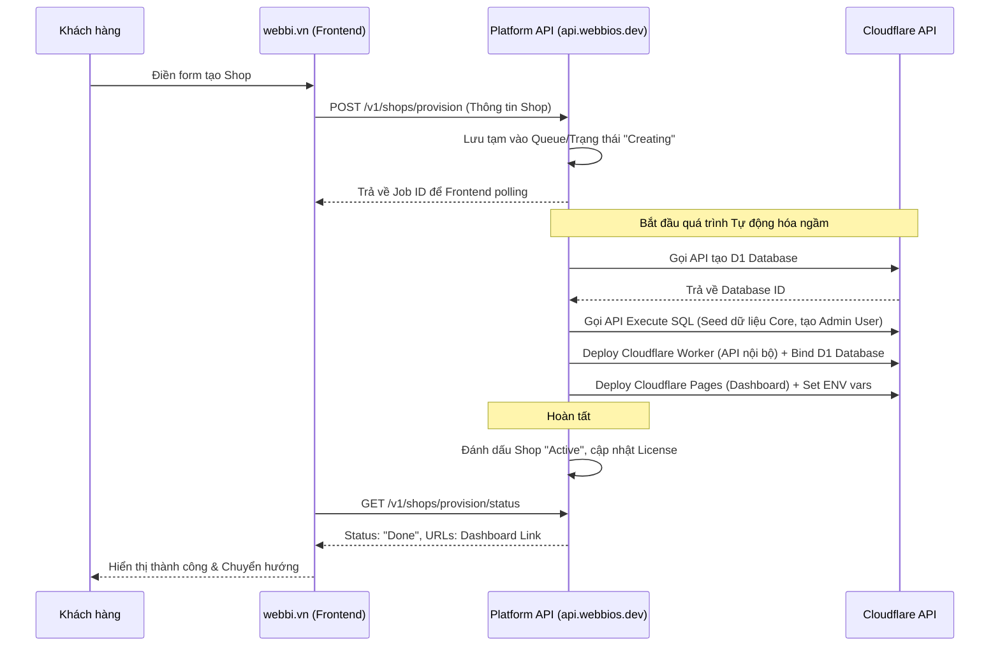

# Quy trình tạo Shop tự động thông qua Platform API

Tài liệu này mô tả luồng kỹ thuật đằng sau quá trình tạo Shop tự động (Automated Provisioning Workflow) khi khách hàng đăng ký trên `webbi.vn` hoặc `getwebbi.com`.

## 1. Luồng Tương tác (Interaction Flow)

1. **Khách hàng** truy cập trang đăng ký, điền thông tin (Tên shop, Subdomain mong muốn, Gói cước).
2. **Frontend đăng ký** gọi API đến **Platform API Gateway** (`api.webbios.dev/v1/shops/provision`).
3. **Platform API Gateway** xác thực yêu cầu, kiểm tra tính hợp lệ của Subdomain, sau đó đưa Job vào Hàng đợi (Queue) hoặc chạy kịch bản ngầm (Background Script).

## 2. Kịch bản Script chạy ngầm (Background Script)

Script này sẽ tự động hóa các bước mà trước đây thực hiện thủ công bằng Webbi CLI:

### Bước 1: Khởi tạo tài nguyên trên Cloudflare
- Gọi Cloudflare API (D1) để tạo Database mới cho khách hàng: `webbios_core_db_[shop_id]`.
- Lưu trữ ID của Database vừa tạo vào Database của Platform.

### Bước 2: Khởi tạo dữ liệu gốc (Seeding)
- Kết nối vào Database D1 vừa tạo.
- Thực thi Script `seed.sql` gốc của hệ điều hành WebbiOS Core (Đã loại bỏ "Kho ứng dụng" khỏi mặc định).
- Cập nhật thông tin Admin User bằng email/password mà khách hàng vừa đăng ký.

### Bước 3: Cấu hình và Deploy WebbiOS Core (Dashboard)
- Sử dụng Cloudflare Pages API để clone/deploy bản release mới nhất của `webbios-dashboard` vào Subdomain của khách (VD: `admin.shop1.webbios.vn`).
- Tiêm (Inject) các biến môi trường vào project Pages vừa deploy:
  - `VITE_PLATFORM_API_URL`: https://api.webbios.dev
  - Liên kết với D1 Database ID vừa tạo.

### Bước 4: Deploy API Server Nội bộ (Worker)
- Deploy bản release mới nhất của `webbios-api` (Cloudflare Worker) cho riêng Shop đó.
- Ràng buộc (Bind) Worker với Database D1 tương ứng.

### Bước 5: Phân bổ License và Hoàn tất
- Ghi nhận thông tin License, Shop ID, Chủ sở hữu vào Platform Database.
- Gửi Email tự động cho khách hàng kèm link truy cập Dashboard và thông tin đăng nhập.

## 3. Kiến trúc Đề xuất để thực hiện kịch bản

## 4. Giai đoạn kiểm thử (Proof of Concept)

Thay vì xây dựng Frontend ngay, chúng ta sẽ bắt đầu bằng cách viết một Endpoint trên Platform API: `POST /api/v1/shops/provision` nhận Payload dạng JSON.

Dùng Postman hoặc cURL để gọi Endpoint này, theo dõi log của Worker xem nó có giao tiếp thành công với Cloudflare API để tự động hóa 5 bước trên hay không. Khi API này ổn định 100%, Frontend webbi.vn chỉ việc gọi đến API này là xong.
